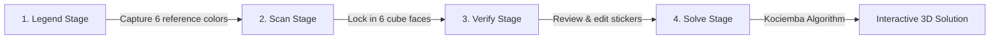

# Rubik's Cube Solver 🧩

An interactive, web-based Rubik's Cube Solver built with **Streamlit**, **OpenCV**, **`streamlit-webrtc`**, **Three.js**, and the **Kociemba Two-Phase Algorithm**.

This application captures your physical Rubik's Cube faces via live camera stream, accurately identifies custom sticker colors using user-calibrated legend anchors in a cylindrical HSV feature space, allows visual verification/editing, and provides an interactive 3D step-by-step solution player.

---

## 🛠️ Tech Stack & Architecture

- **Frontend UI & Application Flow**: [Streamlit](https://streamlit.io/)
- **Live Video Streaming**: `streamlit-webrtc` (WebRTC camera stream over STUN)
- **Computer Vision & Color Sampling**: [OpenCV](https://opencv.org/) (`cv2`) & [NumPy](https://numpy.org/)
- **Color Classification**: Cylindrical HSV vector space matching against calibrated user legend anchors
- **Solving Engine**: [Kociemba](https://pypi.org/project/kociemba/) Two-Phase Algorithm (Herbert Kociemba)
- **3D Visualization**: [Three.js](https://threejs.org/) embedded in custom Streamlit WebGL components

---

## 📂 Project Structure

```
rubiks-solver/
├── app.py                     # Main Streamlit web application controller
├── requirements.txt           # Python package dependencies
├── README.md                  # Project documentation & usage guide
├── .gitignore                 # Version control exclusion rules
├── assets/                    # Media assets (demo videos, screenshots)
│   ├── Rubik's Cube Solver.mp4
│   └── capture.jpg
├── solver/                    # Core Rubik's Solver package
│   ├── __init__.py            # Public package API exports
│   ├── config.py              # Application configuration & constants
│   ├── cube3d.py              # Three.js 3D WebGL cube renderer
│   ├── cube_solver.py         # Cubestring construction & Kociemba integration
│   ├── legend.py              # Cylindrical HSV vector classification
│   └── live_scan.py           # WebRTC live stream frame processing
└── tests/                     # Test suite
    ├── __init__.py
    ├── test_3d.py             # 3D visualizer component test harness
    └── test_solver.py         # Automated unit tests for solver & legend logic
```

---

## ⚙️ Installation & Local Setup

### 1. Clone the repository
```bash
git clone https://github.com/rohan02110/Rubik-s-cube-solver.git
cd Rubik-s-cube-solver
```

### 2. Create and activate virtual environment
- **Windows (PowerShell)**:
  ```powershell
  python -m venv venv
  .\venv\Scripts\Activate.ps1
  ```
- **macOS / Linux**:
  ```bash
  python3 -m venv venv
  source venv/bin/activate
  ```

### 3. Install dependencies
```bash
pip install -r requirements.txt
```

### 4. Launch the application
```bash
streamlit run app.py
```

---

## 🔄 Application Workflow



1. **Legend Stage**: Capture 1 reference sticker sample for each of your cube's 6 colors under your ambient lighting.
2. **Scan Stage**: Scan all 6 faces (`Front → Right → Back → Left → Up → Down`) using the live camera feed with an overlaid 3×3 grid.
3. **Verify Stage**: View the scanned 54-sticker net layout. Click any sticker to cycle colors if lighting caused misreadings.
4. **Solve Stage**: Generates a 54-character cubestring, solves the cube using Kociemba's algorithm, and renders an interactive 3D WebGL cube step-by-step player.

---

## 🧪 Running Unit Tests

Run the automated test suite using standard Python `unittest`:

```bash
python -m unittest discover -s tests -p "test_*.py"
```

---

## 📜 License

Distributed under the MIT License. See `LICENSE` for details.
